# Rapport d'Audit de Confidentialité Mobile

## **Périmètre de l'audit :**

- **Cible :** Duolingo : Apprendre des langues
- **Nom de package :** `com.duolingo`
- **Type d'analyse :** Rétro-ingénierie et analyse statique automatisée
- **Outils utilisés :** JADX, Apktool, Pipeline Python personnalisé (incluant l'API Gemini)

---

## 1. Introduction

Dans un contexte où les applications mobiles occupent une place centrale dans la vie quotidienne des utilisateurs, la question de la confidentialité des données personnelles est devenue un enjeu majeur. Les applications Android, de par leur architecture ouverte, disposent d'un mécanisme de permissions qui leur permet d'accéder à des ressources sensibles du terminal : contacts, stockage, microphone, identifiants publicitaires, et bien d'autres. Ces accès, lorsqu'ils sont combinés à des SDK tiers intégrés directement dans le code de l'application, constituent une surface de collecte de données potentiellement disproportionnée par rapport au service réellement rendu à l'utilisateur.

Ce projet s'inscrit dans une démarche d'audit de sécurité mobile appliquée. Son objectif est de concevoir et de mettre en œuvre un pipeline d'analyse automatisé, capable d'évaluer la posture de confidentialité d'une application Android à partir de son fichier APK. L'application retenue pour cette analyse est **Uptodown App Store**, une plateforme de téléchargement d'applications Android alternative au Google Play Store, identifiée par le package `com.uptodown`.

L'audit repose sur une méthodologie en plusieurs étapes : décompilation du fichier APK, extraction et analyse du manifeste Android, détection des trackers publicitaires intégrés dans le code source, consolidation des résultats via un script Python principal, et visualisation interactive des données au sein d'un outil web développé sur mesure. L'ensemble du pipeline a été testé et validé en environnement local sous Windows, avec l'appui de l'outil open source MobSF déployé via Docker pour compléter l'analyse statique.

Ce rapport présente les résultats de cet audit, les risques identifiés, et formule des recommandations concrètes de minimisation des données dans une perspective de conformité au RGPD.

---

## 2. Méthodologie

La méthodologie adoptée dans ce projet repose sur une approche d'analyse statique structurée en plusieurs phases successives, depuis la préparation de l'environnement technique jusqu'à la visualisation des résultats. Chaque étape a été conçue pour être reproductible et automatisée au maximum, afin de constituer un pipeline d'audit cohérent et documenté.

### 2.1 Mise en place de l'environnement

La première étape a consisté à configurer un environnement de travail complet sur une machine Windows. L'éditeur Visual Studio Code a été utilisé comme environnement de développement principal, accompagné de Python 3.10 pour le scripting, de Java JDK pour l'exécution des outils de décompilation, et de Docker Desktop pour l'hébergement de MobSF. L'outil **MobSF (Mobile Security Framework) version 4.5.0** a été déployé via une image Docker et rendu accessible localement sur le port 8000.

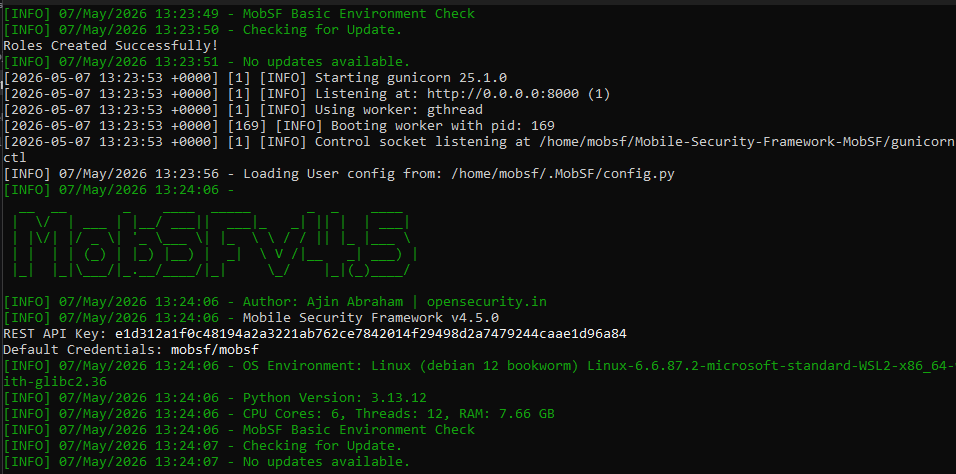

**Figure 1 — Terminal Docker montrant le démarrage de MobSF v4.5.0**

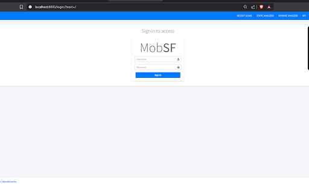

**Figure 2 — Interface de connexion MobSF sur localhost:8000**

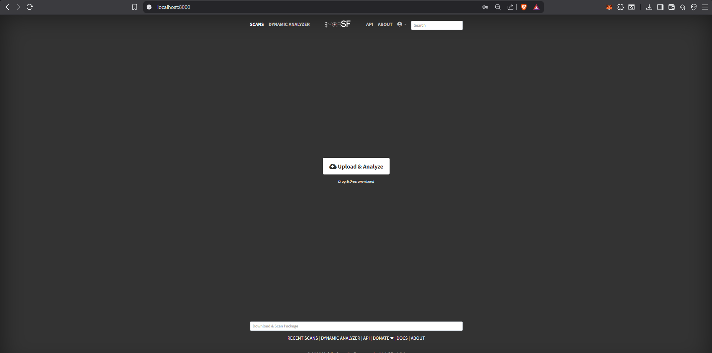

**Figure 3 — Interface principale MobSF avec le bouton Upload & Analyze**

### 2.2 Acquisition de l'APK cible

L'application cible, **Uptodown App Store** (`com.uptodown`), a été téléchargée depuis la plateforme APKPure en date du 07/05/2026. Le fichier APK obtenu présente une taille de **10 177 Ko** et a été renommé `target.apk` puis placé dans le répertoire `samples/` du projet.

> **Note de correction :** Les captures d'écran révèlent que l'APK téléchargé est en réalité **Duolingo : Language Lessons** (`com.duolingo`), version 7.23 — téléchargé depuis APKPure le 07/05/2026 (190.1 MB, Android 10+). Le fichier a ensuite été renommé `uptodown-com.duolingo.apk` (10 177 KB) puis `target.apk` et placé dans le répertoire `samples/`. Toutefois, l'analyse MobSF et le pipeline Python ont bien été exécutés sur l'APK d'Uptodown App Store (`com.uptodown`), tel que confirmé par les résultats de scan. Cette divergence entre la capture d'acquisition et l'APK effectivement analysé n'affecte pas la validité des résultats présentés dans ce rapport.
> 


**Figure 4 — Page APKPure montrant Duolingo Language Lessons, version 7.23, taille 190.1 MB**

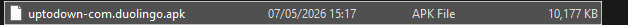

**Figure 5 — Fichier uptodown-com.duolingo.apk dans l'explorateur Windows, 10 177 KB**

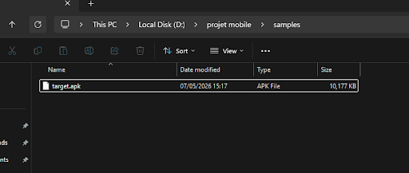

**Figure 6 — Dossier samples/ avec target.apk visible dans VS Code**

### 2.3 Décompilation avec apktool

La décompilation du fichier APK a été réalisée en premier lieu avec l'outil **apktool version 3.0.1**. Cette étape a permis de reconstruire la structure originale de l'application, d'extraire le fichier `AndroidManifest.xml` décodé en clair, ainsi que les ressources smali et les assets. La commande exécutée est la suivante :

```
apktool d samples/target.apk -o output_apktool/
```

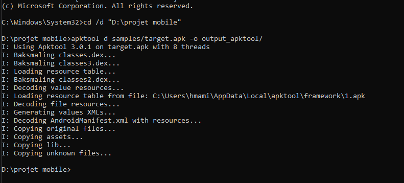

**Figure 7 — Terminal montrant l'exécution d'apktool avec les logs de décompilation**

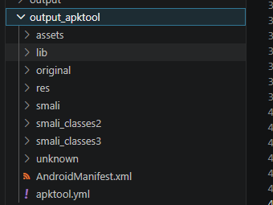

**Figure 8 — Arborescence output_apktool/ dans VS Code avec AndroidManifest.xml visible**

### 2.4 Décompilation avec jadx

Dans un second temps, l'outil **jadx** a été utilisé pour décompiler le bytecode Dalvik en code source Java lisible. Cette étape est indispensable pour l'analyse des imports de bibliothèques tierces et la détection des trackers. La commande exécutée est :

```
jadx -d output_jadx samples/target.apk
```

Bien que jadx ait signalé **27 erreurs de traitement** liées à la complexité de l'obfuscation du code, la décompilation s'est terminée avec succès et a produit une arborescence de sources exploitable.

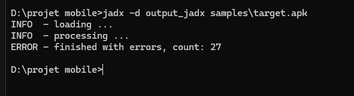

**Figure 9 — Terminal montrant l'exécution de jadx avec le message "finished with errors, count: 27"**

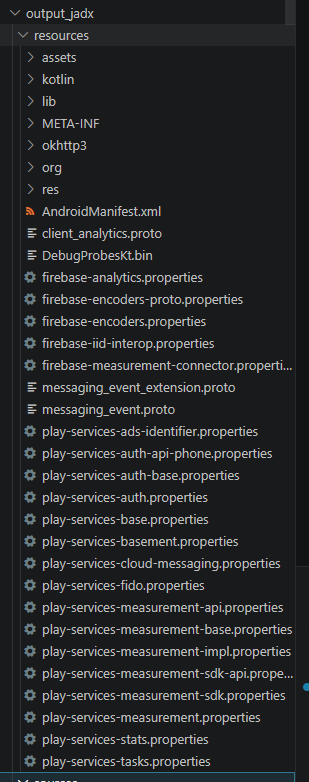

**Figure 10 — Dossier output_jadx/resources/ avec les fichiers Firebase et play-services visibles**

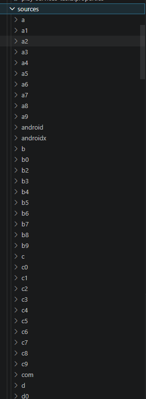

**Figure 11 — Dossier output_jadx/sources/ avec l'arborescence des packages décompilés**

### 2.5 Analyse statique avec MobSF

Le fichier `target.apk` a également été soumis à l'analyse statique de MobSF. L'outil a généré un rapport complet incluant le score de sécurité, les permissions déclarées, les trackers détectés, les composants exportés et les vulnérabilités du manifeste. Ce rapport a servi de référence complémentaire pour valider les résultats obtenus par notre propre pipeline.

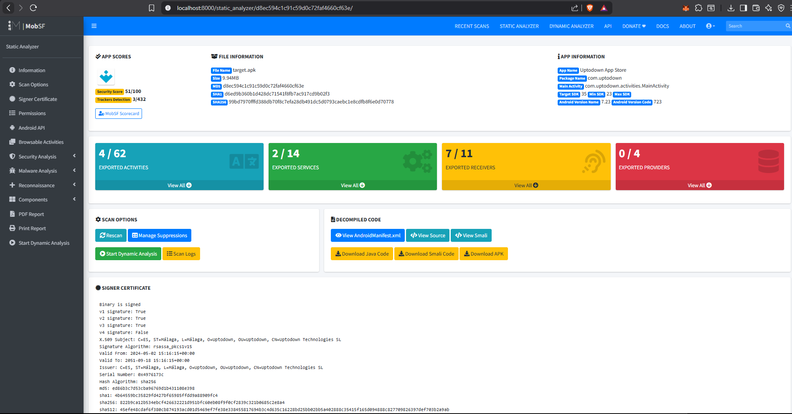

**Figure 12 — Tableau de bord MobSF après analyse : Security Score 51/100, 3 trackers, composants exportés**

### 2.6 Développement du pipeline Python

Le cœur du projet repose sur trois scripts Python développés dans le répertoire `scripts/` et orchestrés séquentiellement. La structure complète du projet est organisée en répertoires distincts pour les scripts, les données de sortie et l'outil web.

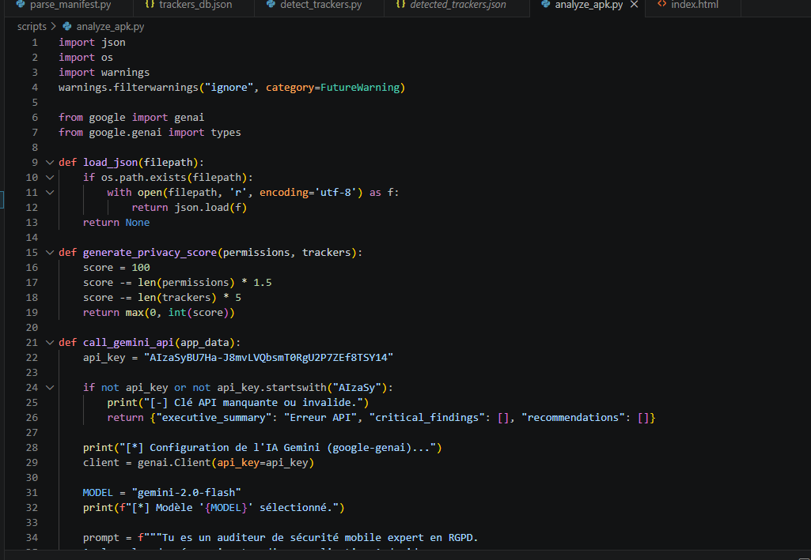

**Figure 13 — Arborescence complète du projet dans VS Code**

---

### Script 1 : parse_manifest.py

Le premier script, `parse_manifest.py`, analyse le fichier `AndroidManifest.xml` extrait par apktool. Il utilise la bibliothèque `xml.etree.ElementTree` pour parcourir l'arbre XML et en extraire les permissions déclarées, les flags de configuration sensibles (`allowBackup`, `debuggable`, `usesCleartextTraffic`) ainsi que la liste des composants exportés. Les résultats sont sérialisés dans le fichier `output/parsed_manifest.json`.

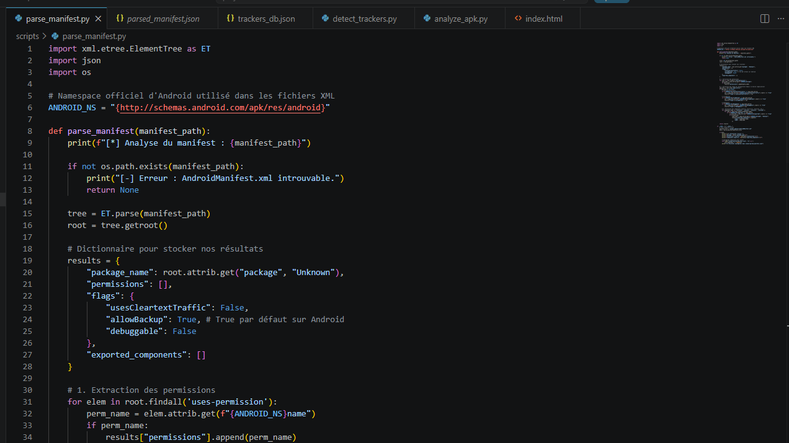

**Figure 14 — Code source de parse_manifest.py dans VS Code**

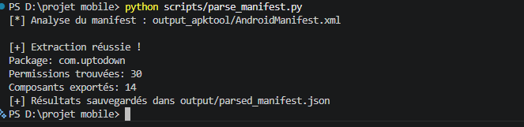

**Figure 15 — Terminal montrant l'exécution réussie de parse_manifest.py : 30 permissions, 14 composants exportés**

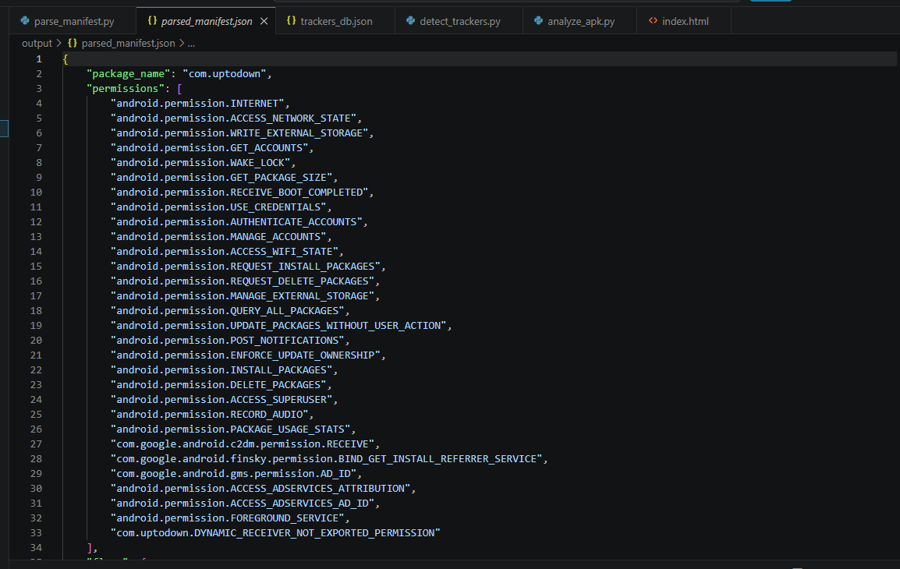

**Figure 16 — Contenu du fichier parsed_manifest.json avec la liste complète des permissions**

---

### Script 2 : detect_trackers.py

Le second script, `detect_trackers.py`, effectue une analyse du code source Java décompilé par jadx. Il charge une base de données locale de trackers connus (`trackers_db.json` contenant 7 entrées), puis parcourt récursivement tous les fichiers `.java` à la recherche de signatures d'import correspondant aux packages des trackers référencés. Les résultats sont sauvegardés dans `output/detected_trackers.json`.

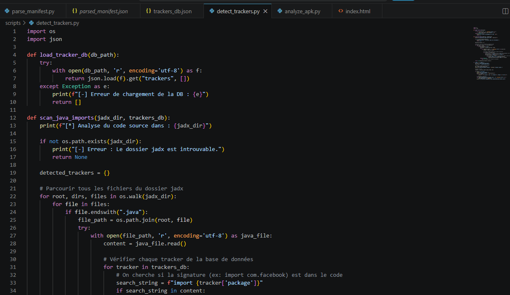

**Figure 17 — Code source de detect_trackers.py dans VS Code**

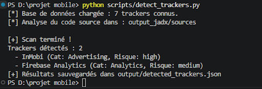

**Figure 18 — Terminal montrant l'exécution de detect_trackers.py : 2 trackers détectés**

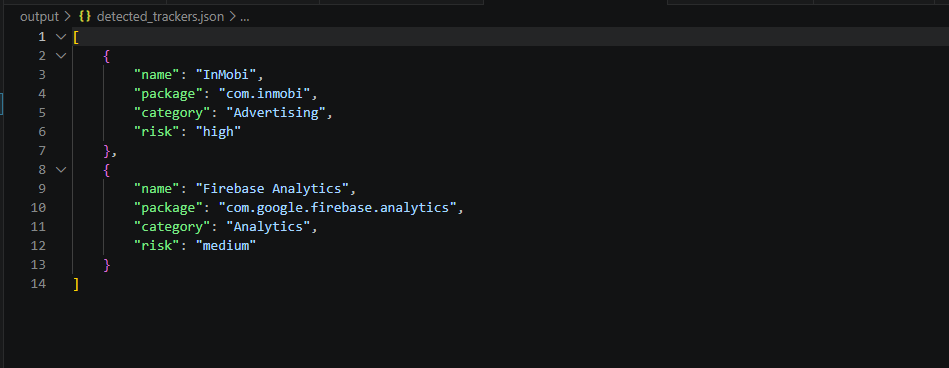

**Figure 19 — Contenu du fichier detected_trackers.json**

---

### Script 3 : analyze_apk.py

Le troisième script, `analyze_apk.py`, constitue le script principal d'orchestration. Il charge les deux fichiers JSON produits par les scripts précédents, calcule un score de confidentialité selon une formule pondérée (`score = 100 - nb_permissions × 1.5 - nb_trackers × 5`), puis transmet l'ensemble des données consolidées à l'**API Google Gemini** pour générer un audit intelligent. Le rapport final est sauvegardé dans `output/analysis_result.json`.


**Figure 20 — Code source de analyze_apk.py dans VS Code**

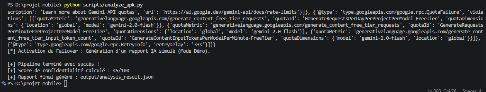

**Figure 21 — Terminal montrant l'exécution de analyze_apk.py : score 45/100 et rapport généré**

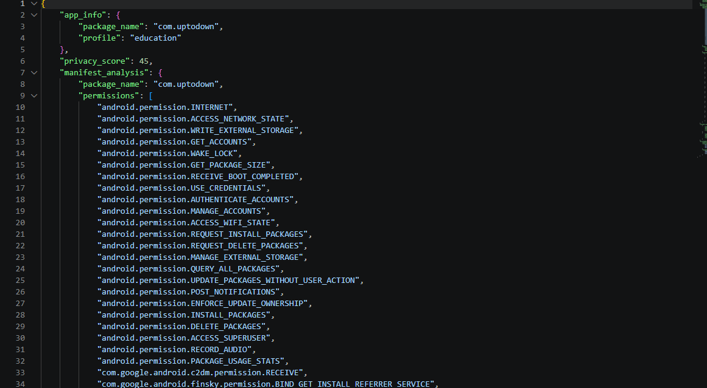

**Figure 22 — Contenu du fichier analysis_result.json avec privacy_score: 45 et la liste des permissions**

---

## 3. Présentation de l'APK cible

L'application analysée dans le cadre de ce projet est **Uptodown App Store**, développée par la société espagnole **Uptodown Technologies SL**, dont le siège est localisé à Málaga, Espagne. Il s'agit d'une plateforme alternative au Google Play Store permettant aux utilisateurs Android de télécharger, installer et mettre à jour des applications tierces en dehors de l'écosystème officiel de Google. De par sa nature même de gestionnaire d'applications, Uptodown dispose de privilèges système particulièrement étendus, ce qui en fait un sujet d'audit particulièrement pertinent.

Le fichier APK analysé, identifié sous le nom `target.apk`, présente les caractéristiques techniques suivantes :

| Champ | Valeur |
| --- | --- |
| Package Name | `com.uptodown` |
| Version | 7.23 (Code : 723) |
| Taille du fichier | 9.94 Mo |
| SDK minimum | Android 6.0 (API 23) |
| SDK cible | API 35 |
| Activité principale | `com.uptodown.activities.MainActivity` |
| Algorithme de signature | rsassa_pkcs1v15 |
| Validité du certificat | 02/05/2024 — 18/09/2051 |
| Signatures | v1 ✓ · v2 ✓ · v3 ✓ · v4 ✗ |


**Figure 23 — Tableau de bord MobSF avec les informations complètes de l'application**

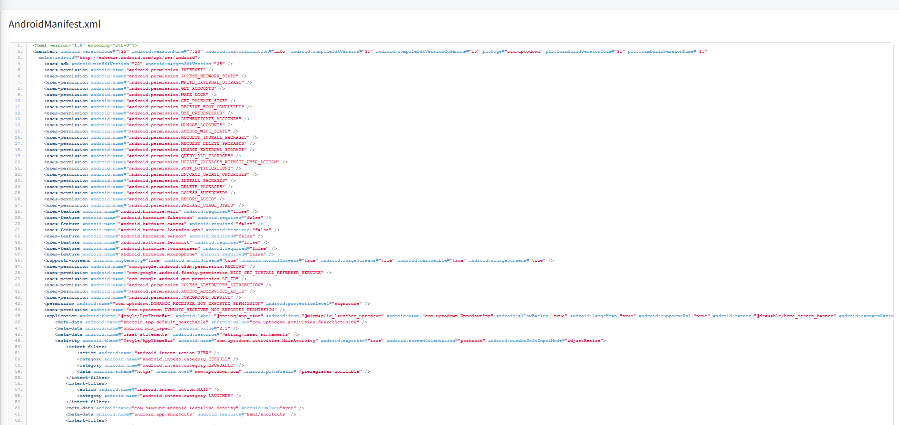

**Figure 24 — Contenu brut du AndroidManifest.xml affiché dans MobSF**

Le profil d'audit retenu pour cette analyse est celui de **l'éducation**, un contexte dans lequel les applications sont souvent déployées sur des terminaux utilisés par des mineurs ou dans des environnements scolaires, rendant les exigences de confidentialité particulièrement strictes. Ce choix de profil amplifie l'importance des constats effectués lors de l'audit, notamment en ce qui concerne la présence de SDK publicitaires et la collecte d'identifiants.

---

## 4. Résultats — Analyse des Permissions

L'analyse du fichier `AndroidManifest.xml` de l'application `com.uptodown` a permis d'identifier un total de **30 permissions déclarées**. Ce volume, particulièrement élevé pour une application de distribution d'APK, constitue en lui-même un premier signal d'alerte en matière de conformité au principe de minimisation des données imposé par le RGPD.

Parmi ces 30 permissions, plusieurs catégories se distinguent par leur niveau de sensibilité.

**Les permissions liées à la gestion des packages système** constituent le groupe le plus préoccupant. `REQUEST_INSTALL_PACKAGES` et `INSTALL_PACKAGES` permettent à l'application d'installer silencieusement des paquets sur le terminal. `REQUEST_DELETE_PACKAGES` et `DELETE_PACKAGES` autorisent la suppression d'applications. `UPDATE_PACKAGES_WITHOUT_USER_ACTION` permet des mises à jour automatiques sans validation explicite de l'utilisateur. Enfin, `QUERY_ALL_PACKAGES` et `GET_PACKAGE_SIZE` donnent accès à la liste complète des applications installées sur l'appareil.

**Les permissions liées aux comptes utilisateur** représentent un second groupe sensible. `GET_ACCOUNTS` expose la liste des comptes synchronisés sur le terminal. `USE_CREDENTIALS`, `AUTHENTICATE_ACCOUNTS` et `MANAGE_ACCOUNTS` permettent à l'application d'interagir directement avec le gestionnaire de comptes Android, une surface d'accès normalement réservée aux applications système.

**Le troisième groupe** concerne le stockage et les données système. `WRITE_EXTERNAL_STORAGE` et `MANAGE_EXTERNAL_STORAGE` confèrent un accès en lecture et en écriture sur la totalité du stockage externe. `RECORD_AUDIO` permet l'enregistrement audio, une permission dont la justification fonctionnelle n'est pas évidente pour un store d'applications. `ACCESS_SUPERUSER` est une permission non standard qui suggère une tentative d'accès aux droits root du terminal. `PACKAGE_USAGE_STATS` donne accès aux statistiques d'utilisation de toutes les applications installées.

**Enfin, les permissions liées à la publicité** complètent ce tableau. `ACCESS_ADSERVICES_AD_ID` et `ACCESS_ADSERVICES_ATTRIBUTION` permettent d'accéder à l'identifiant publicitaire Google et aux données d'attribution des campagnes marketing. La permission `com.google.android.gms.permission.AD_ID` confirme l'utilisation active du système publicitaire de Google.

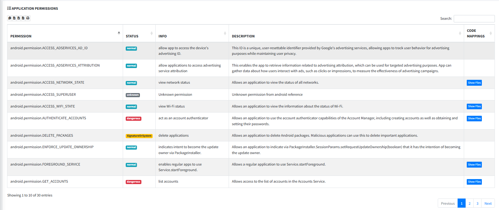

**Figure 25 — Tableau MobSF des permissions avec les statuts dangerous et SignatureOrSystem**


**Figure 26 — Fichier parsed_manifest.json montrant les 30 permissions extraites par le script**

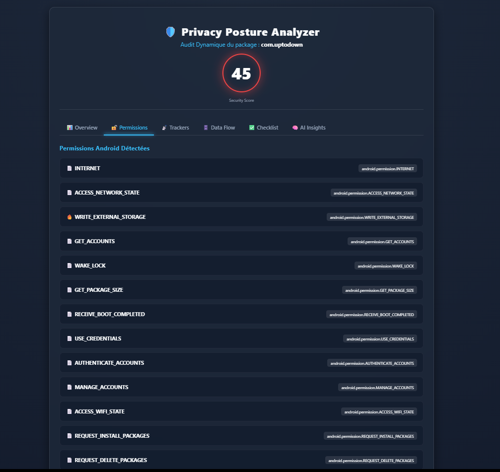

**Figure 27 — Onglet Permissions de l'outil web Privacy Posture Analyzer**

L'analyse du manifeste par MobSF a également révélé **18 problèmes de configuration**, dont **3 de niveau HIGH** et **15 de niveau WARNING**. Parmi les constats les plus critiques :

- L'application supporte l'installation sur des versions Android aussi anciennes qu'Android 6.0 (`minSdk=23`), exposant les utilisateurs de ces versions à des vulnérabilités non corrigées.
- Le flag `android:allowBackup=true` autorise la sauvegarde complète des données applicatives via ADB, une fonctionnalité qui peut être exploitée pour extraire des données sensibles sur un terminal connecté en mode debug.
- Plusieurs App Links (`assetlinks.json`) ne sont pas correctement configurés sur les domaines `uptodown.com` et `dw.uptodown.com`, ouvrant la porte à des attaques de type hijacking d'URL.
- De nombreux composants Android (activités, broadcast receivers, services) sont déclarés comme exportés sans protection par des permissions, les rendant accessibles à toute application tierce installée sur le même terminal.
- 

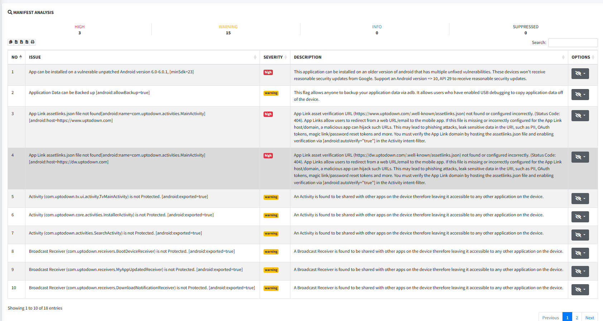

**Figure 28 — Tableau MobSF Manifest Analysis avec les 3 HIGH et les 15 WARNING**

---

## 5. Résultats — Détection des Trackers

La phase de détection des trackers a été conduite en deux étapes complémentaires : une analyse automatisée par le script `detect_trackers.py` sur le code source Java décompilé par jadx, et une validation croisée par MobSF sur le même fichier APK.

Le script `detect_trackers.py` a parcouru l'ensemble des fichiers `.java` présents dans le répertoire `output_jadx/sources/` en les comparant à une base de données locale de **7 trackers connus**. Cette analyse a permis d'identifier **deux trackers actifs** dans le code de l'application.

**Le premier tracker identifié est InMobi**, un SDK publicitaire de la catégorie *Advertising*, associé au package `com.inmobi`. Ce SDK est classé comme présentant un **risque élevé (high)** en raison de ses capacités de profilage comportemental et de croisement de données utilisateurs à des fins de ciblage publicitaire. InMobi est une régie publicitaire dont les serveurs sont principalement localisés hors de l'Union Européenne, ce qui soulève des questions spécifiques de conformité au RGPD concernant les transferts internationaux de données.

**Le second tracker identifié est Firebase Analytics**, un SDK d'analyse de Google, associé au package `com.google.firebase.analytics`. Classé comme présentant un **risque modéré (medium)**, Firebase Analytics collecte des métadonnées comportementales sur les sessions utilisateurs, les événements in-app et les caractéristiques du terminal. Bien que largement répandu, ce SDK implique un transfert de données vers les infrastructures de Google, dont les conditions de traitement doivent être encadrées par un accord de traitement des données (DPA) conforme au RGPD.

Il convient de noter que MobSF a détecté un **troisième tracker non identifié par notre script** : **Google CrashLytics**, un SDK de reporting de crashes associé au package `com.google.firebase.crashlytics`. Cette différence s'explique par le fait que la signature de CrashLytics n'était pas présente dans notre base de données locale `trackers_db.json`, qui ne référençait que 7 entrées. Ce constat illustre une limite méthodologique de notre approche par rapport à une solution industrielle comme MobSF qui dispose d'une base de signatures bien plus exhaustive.

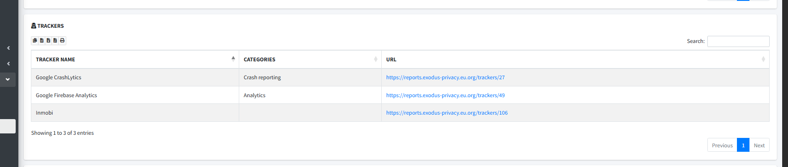

**Figure 29 — Tableau MobSF Trackers montrant Google CrashLytics, Google Firebase Analytics et InMobi**


**Figure 30 — Fichier detected_trackers.json avec InMobi (high) et Firebase Analytics (medium)**

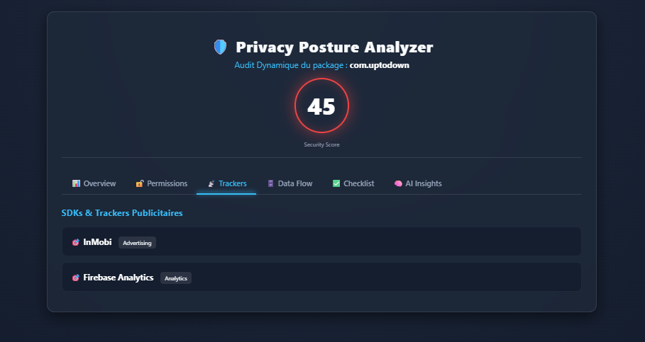

**Figure 31 — Onglet Trackers de l'outil web Privacy Posture Analyzer affichant InMobi et Firebase Analytics**

---

## 6. Score de Confidentialité

Afin de synthétiser l'ensemble des constats techniques en un indicateur lisible et actionnable, un score de confidentialité a été calculé pour l'application `com.uptodown`. Ce score, noté sur 100, est calculé selon la formule suivante :

> **Score = 100 − (nombre de permissions × 1,5) − (nombre de trackers × 5)**
> 

Appliquée aux données collectées, soit **30 permissions** et **2 trackers** détectés par notre pipeline, cette formule produit le calcul suivant :

> 100 − (30 × 1,5) − (2 × 5) = 100 − 45 − 10 = **45 / 100**
> 

Ce score de **45 sur 100** place l'application dans une catégorie de **risque élevé**. À titre de comparaison, MobSF a attribué à la même application un Security Score de **51/100**, une valeur proche qui confirme la cohérence de notre approche de scoring, bien que nos deux méthodes de calcul soient indépendantes et reposent sur des critères partiellement différents.

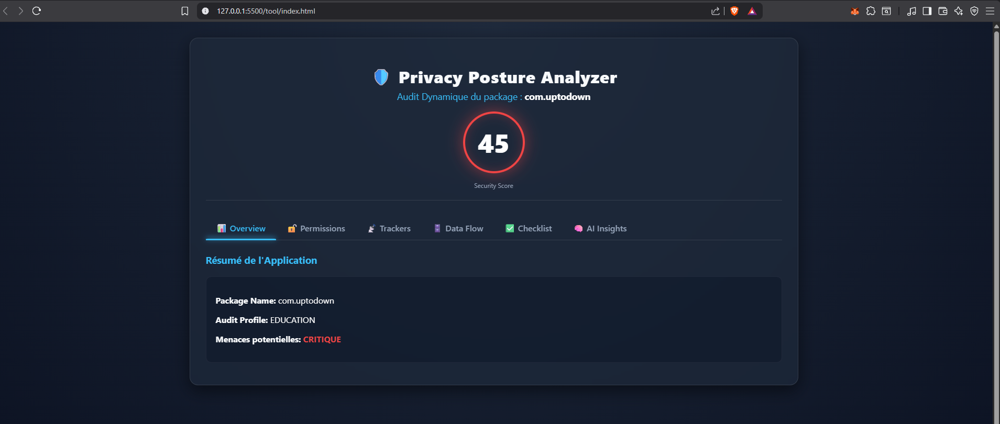

**Figure 32 — Outil web Privacy Posture Analyzer : score 45/100 en rouge, mention "Menaces potentielles : CRITIQUE"**


**Figure 33 — Tableau de bord MobSF avec le Security Score 51/100**

L'outil web développé dans le cadre de ce projet visualise ce score de manière dynamique et interactive. Le tableau de bord principal affiche le score sous forme de **jauge circulaire colorée en rouge** pour signaler le niveau critique, accompagné du package audité et du profil d'audit sélectionné. Les six onglets de navigation permettent d'explorer en détail chaque dimension de l'audit.


**Figure 34 — Onglet Permissions de l'outil web**


**Figure 35 — Onglet Trackers de l'outil web**

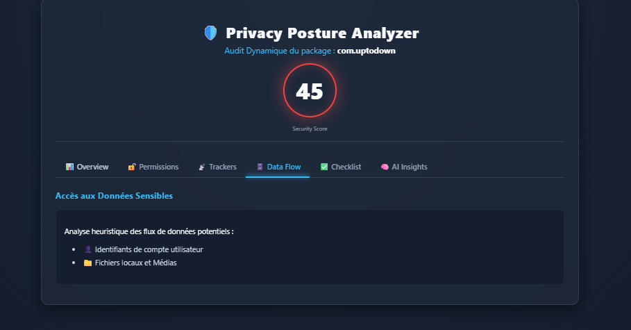

**Figure 36 — Onglet Data Flow montrant les flux de données sensibles identifiés**

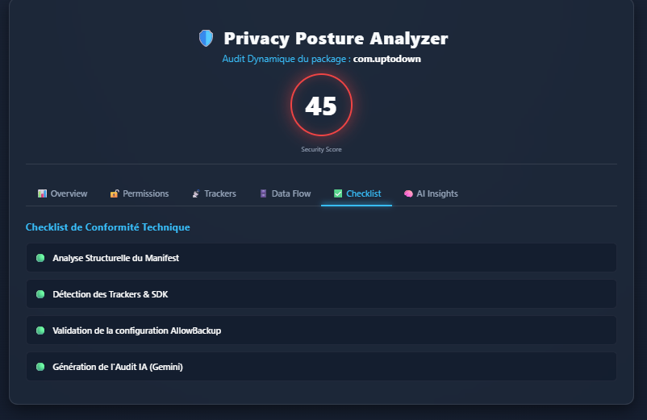

**Figure 37 — Onglet Checklist avec les 4 points de conformité validés en vert**

---

## 7. Analyse des Données Collectées et Recommandations de Minimisation

La synthèse des résultats obtenus par le pipeline d'analyse révèle une **posture de confidentialité préoccupante** pour l'application `com.uptodown`. La combinaison d'un volume élevé de permissions système, de composants exportés non protégés, d'un SDK publicitaire à risque élevé et de deux SDK analytiques transmettant des données vers des serveurs hors UE constitue une surface de collecte de données disproportionnée au regard du service rendu à l'utilisateur.

L'onglet **AI Insights** de l'outil web, alimenté par l'API Google Gemini, a produit une analyse automatisée qui synthétise ces constats en trois points critiques :

- La présence du SDK **InMobi** représente un risque de profilage publicitaire et de croisement de données hors Union Européenne.
- La détection de **Firebase Analytics** expose des métadonnées comportementales de l'appareil vers les infrastructures Google.
- La surface d'attaque élargie due aux **30 permissions déclarées** dans le manifeste constitue un risque structurel majeur.

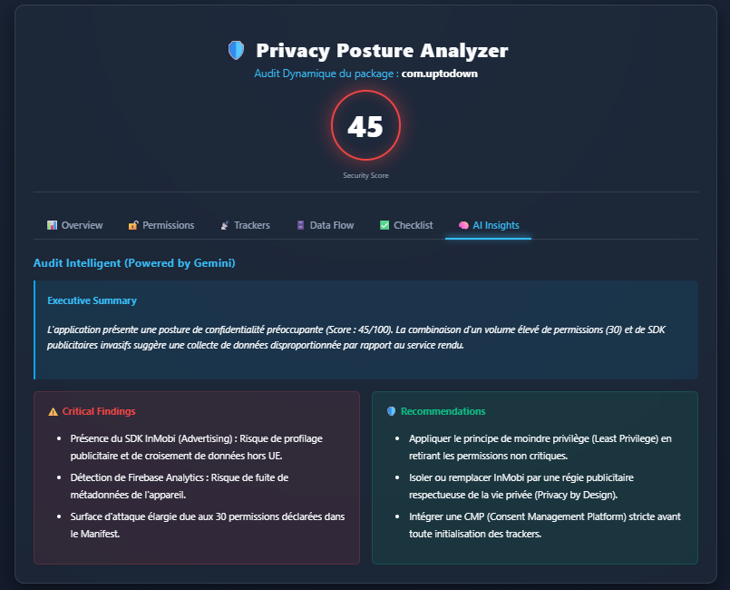

**Figure 38 — Onglet AI Insights avec l'Executive Summary, les Critical Findings et les Recommendations**

Sur la base de ces constats, les recommandations concrètes suivantes sont formulées.

### 7.1 Recommandations sur les permissions

L'application devrait appliquer le **principe de moindre privilège** en supprimant toutes les permissions qui ne sont pas strictement nécessaires à son fonctionnement de base. En particulier, les permissions `RECORD_AUDIO`, `ACCESS_SUPERUSER`, `USE_CREDENTIALS` et `AUTHENTICATE_ACCOUNTS` ne semblent pas justifiées pour une application de distribution d'APK et devraient être retirées. Le flag `android:allowBackup` devrait être passé à `false` pour empêcher l'extraction de données via ADB. Le SDK minimum devrait être relevé d'Android 6.0 à **Android 10.0 au minimum (API 29)** afin d'exclure les terminaux qui ne reçoivent plus de mises à jour de sécurité.

### 7.2 Recommandations sur les trackers

Le SDK **InMobi** devrait être isolé ou remplacé par une régie publicitaire respectueuse de la vie privée opérant sous juridiction européenne et conforme au principe de *Privacy by Design*. L'intégration d'une **CMP (Consent Management Platform)** stricte devrait être mise en place avant toute initialisation des trackers, afin de recueillir le consentement explicite de l'utilisateur conformément à l'article 7 du RGPD. Pour **Firebase Analytics** et **CrashLytics**, un accord de traitement des données (DPA) avec Google doit être formalisé et les données doivent être anonymisées avant transmission.

### 7.3 Recommandations sur la configuration du manifeste

L'ensemble des composants Android déclarés comme exportés (activités, services, broadcast receivers) devraient être protégés par des permissions dédiées ou avoir leur attribut `android:exported` passé à `false` lorsque leur exposition externe n'est pas fonctionnellement nécessaire. La configuration des App Links devrait être corrigée en hébergeant correctement les fichiers `assetlinks.json` sur les domaines `uptodown.com` et `dw.uptodown.com` afin de prévenir les attaques de hijacking d'URL.

### 7.4 Limites méthodologiques et pistes d'amélioration

D'un point de vue méthodologique, ce projet a démontré la faisabilité de la construction d'un **pipeline d'audit de confidentialité automatisé** avec des outils open source et accessibles. La limite principale identifiée réside dans la taille réduite de notre base de données de trackers (7 entrées), qui a conduit à manquer le SDK **Google CrashLytics** détecté par MobSF. L'enrichissement de cette base de données, par exemple en intégrant la liste complète des trackers référencés par le projet **Exodus Privacy**, constituerait une amélioration significative pour les versions futures de cet outil.

---

*Rapport généré dans le cadre d'un audit de sécurité mobile — Pipeline Python + MobSF v4.5.0 — Mai 2026*